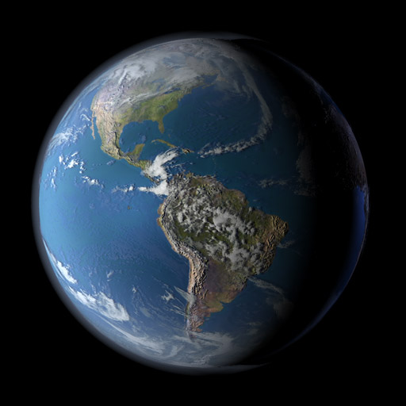

# Earth Three.js

A beautiful interactive 3D Earth visualization built with [Three.js](https://threejs.org/). This project demonstrates realistic rendering of the planet Earth, including:

- High-resolution textures for land, clouds, lights, and bump mapping
- Atmospheric glow using Fresnel effects
- Animated rotation and tilt
- Starfield background
- Interactive camera controls (OrbitControls)

## Demo
Open earth-threejs-eta.vercel.app in your browser to view the Earth in action.



## Features
- **Immersive 3D Earth Visualization:**
	- High-fidelity rendering with bump, specular, and night lights maps for a lifelike experience.
	- Animated rotation and tilt to reflect real planetary motion.

- **Dynamic Atmospheric Effects:**
	- Real-time animated clouds and atmospheric glow using advanced Fresnel shading, enhancing realism and engagement.

- **Interactive Starfield Environment:**
	- Procedurally generated starfield background creates a captivating space setting, ideal for educational, scientific, or marketing presentations.
	- Customizable star density and appearance for tailored visual impact.

- **User Engagement & Interactivity:**
	- OrbitControls allow users to explore the Earth from any angle, driving deeper interaction and retention.
	- Responsive design ensures seamless experience across devices and window sizes.

- **Business & Educational Value:**
	- Perfect for portfolio showcases, product demos, science communication, and immersive data storytelling.
	- Easily customizable for branding, data overlays, or integration into web platforms.

- **Plug-and-Play Simplicity:**
	- No build step required—just open in a browser and present.
	- Modular codebase for rapid prototyping and feature extension.

## Getting Started
1. Clone this repository.
2. Open `index.html` in a modern browser (no build step required).
3. Explore or modify the code in `earth.js` and the `src/` folder.

## File Structure
```
├── index.html           # Entry point
├── earth.js             # Main Three.js scene
├── src/
│   ├── getFresnelMat.js # Fresnel material for glow
│   └── getStarfield.js  # Starfield generator
├── textures/            # Earth and star textures
│   ├── ...              # Various Earth maps
│   └── stars/
│       └── circle.png   # Star texture
├── earth.jpg            # Preview image
```

## Credits
- [NASA Visible Earth](https://visibleearth.nasa.gov/) for Earth textures
- [Three.js](https://threejs.org/) for 3D rendering

## License
This project is for educational and personal portfolio use. See individual texture files for their respective licenses.
